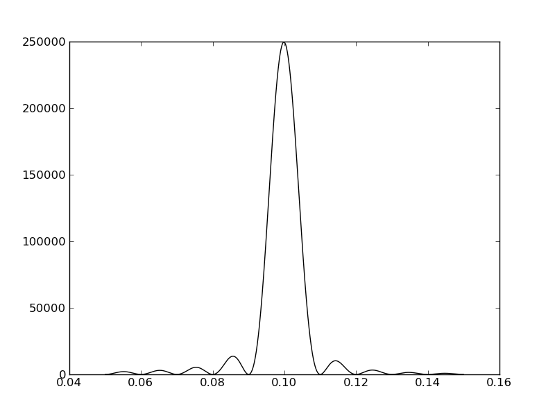
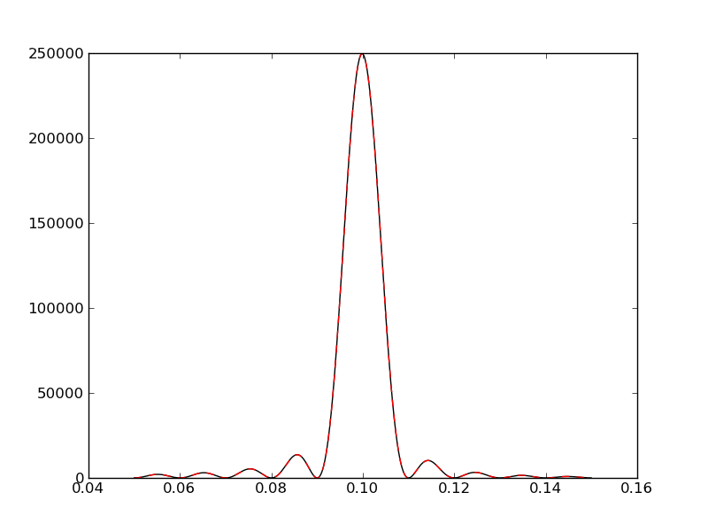

Optimization
============

This page mentions three ways in which code or code usage can be optimized:

* by incorporating existing *subroutines* from other languages into Python code
  (`Python as a glue-language`)
* by simple parallelization
* by controlling existing full-blown shell programs from within Python

.. contents::

Connecting programming languages with F2py
------------------------------------------

Python is one of the easiest languages to learn, and one of the most efficient
to write. Variables need not to be declared, and can even change type within
a single Python program. The *batteries included* strategy, and the availability
of numpy, scipy and pylab allow the programmer to immediately focus on the
problem at hand, without bothering with the details. Such a high-level language
obviously must come at a price: speed. Although numpy and scipy already solve
many of the speed issues, sometimes a problem is just to complicated to be
easily integrated in the numpy and scipy framework. Also, many people, companies
or institutes have a huge tradition in a particular field, resulting in a lot of
code written in Fortran and C, that is fast *and* reliable, albeit perhaps not
easy in use. It would be a tremendous waste of effort to reimplement everything
in Python, probably ending up with a program which is a lot slower and less
reliable than the original source code.

Luckily, Python easily interfaces with existing codes, in particular Fortran and
C. This tutorial focuses on Fortran, but in fact much more tools are available
for C.

An example of the interface capabilities of Python to Fortran and C is already
apparent in numpy and scipy. Most of the optimization and linear algebra code are
in fact wrappers around existing packages such as LAPACK and BLAS. Essentially,
**numpy and scipy do not re-invent the wheel**. Specifically
for this purpose, an ``f2py`` program is installed alongside numpy, which converts
Fortran and C code to a Python library. It is important to mention that this
program does **not** convert Fortran code *to* Python code (that would be slow),
but instead compiles the Fortrano code to a 'shared library', which Python
immediately understands.

An immediate disclaimer is the following: ``f2py`` only works with subroutines,
and not programs. Just like any other Python function, a Fortran subroutine
generally has *input* and *output*. Little change in the code is required for
Python to understand what is input, and what is output. In fact, it is only
necessary to add some comment statements. This implies that **the Fortran code
you use to generate Python modules does not need any adjustments**.

FORTRAN
^^^^^^^^

In this example, we want to ditch the FFT in favour of an explicit Fourier
transform. A reason could be that one perhaps wants to oversample a Fourier
transformation in a narrow passband, but the number of datapoints do not allow
for much zeropadding. In that case, one could write an explicit Fourier
transform in Fortran.

.. raw:: html

   
Click to Show/Hide FORTRAN Code
 

.. sourcecode:: fortran

          subroutine fourier(T,X,F0,DF,N,NF,FR,S1)
    Cf2py intent(in) T
    Cf2py intent(in) X
    Cf2py intent(in) F0
    Cf2py intent(in) DF
    Cf2py intent(in) N
    Cf2py intent(in) NF
    Cf2py intent(out) FR
    Cf2py intent(out) S1
          implicit real*8 (a-h,o-z)
          dimension T(N),X(N)
          dimension FR(NF),S1(NF)
          DOUBLE PRECISION TPF,F0,DF
          DOUBLE PRECISION COX,SOX,TF
          DOUBLE PRECISION S0,C0
          DATA TWOPI/6.28318530717959D0/
          
          TPF = F0*TWOPI
          do 11 K=1,NF
          C0X = 0.
          S0X = 0.
          do 12 I=1,N
          TF = T(I)*TPF  
          S0 = SIN(TF)
          C0 = COS(TF)
          C0X = C0X + C0 * X(I)
          S0X = S0X + S0 * X(I)
    12    end do           
          S1(K) = C0X*C0X + S0X*S0X
          FR(K) = TPF/TWOPI
          TPF=TPF+DF*TWOPI
    11    end do
          RETURN
          END

.. raw:: html

   
        
    
After writing the Fortran routine and saving it to a file ``fourier.f``,
we can run the ``f2py`` program::
    
    $:> f2py -c fourier.f -m ffourier

The ``-c`` options tells us in which file(s) the Fortran code is located, the
``-m`` tells you the name of the Python module the Fortran code will be converted
to. If the Fortran code has other ``*.f`` dependencies, you can easily compile them all in the same Python module::

    $:> f2py -c *.f -m ffourier

The result should be an ``*.so`` file, which is a 'shared library object'. This
shared library can be treated as a normal Python module:

.. sourcecode:: python

    import numpy as np
    import pylab as plt
    import ffourier # this is our Fortran module
    
    # generate a time series with a frequency at 0.1 Hz
    times = np.linspace(0,100,1000)
    signal = np.sin(2*np.pi*0.1*times)
    
    # compute the fourier on a limited region between 0.05 and 0.15 Hz
    f0,df,nf = 0.05,0.00005,2000
    freqf,amplf = ffourier.fourier(times,signal,f0,df,nf)
    
    plt.plot(freqf,amplf,'k-')

    
C
^^

Similar things as for FORTRAN can be done with C/C++. In fact, the number of tools
available for C/C++ are much more numerous (`SWIG <http://www.swig.org/>`_, `scipy.weave <http://www.scipy.org/Weave>`_, `Python docs  <http://docs.python.org/extending/extending.html>`_,...). However, also F2Py
has (somewhat limited) functionality with C code.

Suppose we have a C implemenation of the Fortran function ``fourier`` given above. 

.. raw:: html

   
Click to Show/Hide C Code
 

.. sourcecode:: c

    # include <stdio.h>
    # include <math.h>

    double * fourier(int n, double *t, double *x, double f0, double df, int nf, int nf2, double *fr)
    {
        double twopi,tf,s0,c0;
        double c0x,s0x,tpf;
        int k,i;
        
        twopi = 2.0*M_PI;
        
        tpf = f0*twopi;
        for (k=0;k<nf;k++)
        {
            c0x = 0.0;
            s0x = 0.0;
            for (i=0;i<n;i++)
            {
                tf = t[i]*tpf;
                s0 = sin(tf);
                c0 = cos(tf);
                c0x = c0x + c0 * x[i];
                s0x = s0x + s0 * x[i];
            }
            fr[nf+k] = c0x*c0x + s0x*s0x;
            fr[k] = tpf/twopi;
            tpf = tpf + df*twopi;
        }
        return fr;

        
    }

.. raw:: html

   
        

In contrast to the Fortran subroutine, we need to explicitly write a header
file that explains which variables are intended as input, and which are 
intended as output, and save it to a file ``fourier.pyf``::

    python module cfourier
    interface
        subroutine fourier(n,t,x,f0,df,nf,nf2,fr) result (fr)
        intent(c) fourier
        intent(c)
        integer intent(hide), depend(t) :: n=len(t)
        double precision intent(in) :: t(n) 
        double precision intent(in) :: x(n)
        double precision intent(in) :: f0
        double precision intent(in) :: df
        integer intent(in) :: nf
        integer intent(hide), depend(fr) :: nf2=len(fr)
        double precision intent(in,out) :: fr(nf2)
        end subroutine fourier
    end interface
    end python module cfourier

We run the F2Py program on the header file and source code::

    $:> f2py fourier.pyf fourier.c -c

And can finally use as a normal Python module. Note that the C function has
a slightly different calling signature.

.. sourcecode:: python

    import numpy as np
    import pylab as plt
    import ffourier # this is our Fortran module
    import cfourier # this is our C module
    
    # generate a time series with a frequency at 0.1 Hz
    times = np.linspace(0,100,1000)
    signal = np.sin(2*np.pi*0.1*times)
    
    # compute the fourier on a limited region between 0.05 and 0.15 Hz
    f0,df,nf = 0.05,0.00005,2000
    freqf,amplf = ffourier.fourier(times,signal,f0,df,nf)
    freqc,amplc = cfourier.fourier(times,signal,f0,df,nf,np.zeros(2*nf)).reshape((2,-1))
    
    plt.plot(freqf,amplf,'k-')
    plt.plot(freqc,amplc,'r--')

Multiprocessing
---------------

Usually, you want to write stuff in Fortran because it needs to be fast. Another
solution to write fast code is parallelization. Better yet, how cool would it be
to write Fortran code and parallelize it in Python?

The `multiprocessing package <http://docs.python.org/library/multiprocessing.html>`_
was introduced as of Python 2.6. It is partially
inspired on the ``threading`` package. The difference with the latter is that
``multiprocessing`` actually makes use of different cores, while ``threading``
only allows different threads on one core.

The ``multiprocessing`` package provides high-level tools for parallelization,
such as exchanging objects between processes, synchronization, Pools and Queues. In the following
example, we divide the Fourier computations done above over all the cores that
are available on a computer. This can simply be done by dividing the domain
of the Fourier transform in pieces. We need to define a function that computes
one of these pieces. It is almost identical to the ``ffourier.fourier`` defined
before, except that we need also to pass the power-spectrum array to fill in as a
shared object (``power``), and we need to know which part of the Fourier
transform is beeing computed (given by the starting index ``start``).

.. sourcecode:: python

    def fourier_process(times,signal,f0,df,nf,power,start):
        f1,s1 = ffourier.fourier(times,signal,f0,df,nf)
        power[start:start+nf] = s1

Next, a function is need that divides the Fourier transform in the pieces,
and spawns a ``multiprocessing.Process`` with the adequate arguments. Note that
the number of cores available on a computer can simply be returned with the
function ``multiprocesssing.cpu_count()``.

.. sourcecode:: python

    def fourier(times,signal,f0,df,nf):
        nproc = multiprocessing.cpu_count()
        arr = multiprocessing.Array('d',range(nf)) # shared object for the power spectrum
        processes = [] # a list containing all the processes that will be spawned
        for i in range(nproc):
            nf_run = nf/nproc # how many frequency points need to be sampled per process
            start = i*nf_run # starting index
            startf = f0+start*df # starting frequency       
            p = multiprocessing.Process(target=fourier_process,args=(times,signal,startf,df,nf_run,arr,start))
            p.start() # start the process
            processes.append(p) # and add it to the list
        for i in processes:
            i.join()        # wait until process has ended
        return f0+np.arange(nf)*df,np.array(arr) # and return the results

If you don't want to share data between process, there exist more elegant ways
of solving the problem. Suppose we want to median filter several FITS images in
parallel. We can then use the `multiprocessing.Pool` function in combination
with the `map` function:

.. sourcecode:: python

    import os
    import glob
    import multiprocessing
    import shutil

    import pyfits
    from scipy.ndimage import median_filter

    # Define a function to run on files. The steps are:
    # - read in FITS file
    # - convolve the data in the primary HDU
    # - write out the result to a new file
    def smooth(filename):
        print "Processing %s" % filename
        hdulist = pyfits.open(filename)
        hdulist[0].data = median_filter(hdulist[0].data, 15)
        hdulist.writeto(filename.replace('files/', 'files_smooth/'),
                        clobber=True)

    # Search for all FITS files
    files = glob.glob('files/*.fits')

    # Remove output directory if it already exists
    if os.path.exists('files_smooth'):
        shutil.rmtree('files_smooth')

    # Create output directory
    os.mkdir('files_smooth')

    # Define a 'pool' of 12 processes
    p = multiprocessing.Pool(processes=12)

    # Run the function over all files in parallel
    result = p.map(smooth, files)

Running and controlling shell programs
--------------------------------------

The `subprocess module <http://docs.python.org/library/subprocess.html>`_
provides an interface to run programs (``subprocess.call``) and return the standard
output (``subprocess.check_output``). One can invoke programs in the shell (``shell=True``),
to still have access to shell features (wildcards, pipes, environment variables).

It is also possible to communicate with a program and its output *while it is
executed*, so you don't have to wait until it terminates. This can be used
to check how a program is advancing, and maybe terminate it to restart it with
different input. We give an example of some of the possibilities, by running
a stupid Fortran program ``dummy``, that writes out the numbers from 0 to 20
and their squared value, at a rate of 1 number per second.

.. sourcecode:: fortran

      PROGRAM DUMMY      
      real match,number
      integer i
      number = 0.0        
      do 10,i=0,20
        write(*,*) number,'**2 =',number**2
        call sleep(1)
        number = number+1.0        
 10   CONTINUE
      end

Which can be compiled to the default ``a.out`` by simply running::

    $:> gfortran dummy.f

or something similar.
      
Now the idea is to write a small Python wrapper around it, that reads in the 
input and kills it when it reaches a certain number. For fun, we will also
stop the program for a few seconds when it reaches the number 5, to continue
afterwards again. Finally, we check if the number we gave was reached: if the
returncode is 0, it exited normally (and we did not reach the number), if the
returncode is nonzero, it was killed, and the number was reached.

The modules we need are of course ``subprocess`` to launch and control the
Fortran program, ``signal`` to stop, continue and kill a process, ``sys`` to
get user input from the terminal, and ``time`` let the program sleep between
the stop and continue signal.

.. sourcecode:: python
    
    import subprocess
    import signal
    import time
    import sys

Next, we need some kind of iterator that iterates over the output generated from
the Fortran program, waits until the next output is received, and ends after
the output stream is closed. This is simply done with:

.. sourcecode:: python

    def line_at_a_time(fileobj):
        while True:
            line = fileobj.readline()
            if not line:
                return
            yield line

Finally, we write the *main* part of the program. It will get a the number to
stop the program at from the command line via the ``sys.argv`` variable, start
the Fortran program, catching its standard output to a pipe:

.. sourcecode:: python

    match_number = float(sys.argv[1])
    p1 = subprocess.Popen('./a.out',stdout=subprocess.PIPE)

The return value ``p1`` is a ``Popen`` object. For a full description, see the
`docs <http://docs.python.org/library/subprocess.html#subprocess.Popen>`_. It has
an attribute called ``stdout``, which is a file-like object than can be given
to the read function defined above. We will extract the current number from the
output of the Fortran program, and check if it matches The user-given variable
``match_number``. If it does, we send a kill signal ``SIGKILL`` to the process,
which will kill it. If the number reaches 5, we sill stop it, wait for 5 seconds
and continue again. Else, the program will just report the last line it received
from the Fortran program:

.. sourcecode:: python

    for line in line_at_a_time(p1.stdout):
        check = float(line.split('*')[0])
        if check==match_number:
            print('I got: "{0}"; and it is a match! Killing program now...'.format(line.strip()))
            p1.send_signal(signal.SIGKILL) # equivalent to os.kill(p1.pid,signal.SIGKILL)
        elif check==5.:
            print('I got: "{0}"; that is a nice number, I will just wait here for a moment...'.format(line.strip()))
            p1.send_signal(signal.SIGSTOP)
            time.sleep(5)
            print('... waited long enough, continuing...')
            p1.send_signal(signal.SIGCONT)
        else:
            print('I got: "{0}"; but we are not yet at {1}'.format(line.strip(),match_number))

And finally, we make sure the Fortran program is finished, and ask for its
return code:

.. sourcecode:: python

    retcode = p1.wait()
    if retcode==0:
        print("The program exited normally (return code: {0})".format(retcode))
    else:
        print("The program terminated prematurely (return code: {0})".format(retcode))

After saving the code to the file ``program_control_shell.py``, we can run
it with::

    $:> python program_control_shell.py 10
      I got: "0.0000000     **2 =   0.0000000"; but we are not yet at 10.0
      I got: "1.0000000     **2 =   1.0000000"; but we are not yet at 10.0
      I got: "2.0000000     **2 =   4.0000000"; but we are not yet at 10.0
      I got: "3.0000000     **2 =   9.0000000"; but we are not yet at 10.0
      I got: "4.0000000     **2 =   16.000000"; but we are not yet at 10.0
      I got: "5.0000000     **2 =   25.000000"; that is a nice number, I will just wait here for a moment...
      ... waited long enough, continuing...
      I got: "6.0000000     **2 =   36.000000"; but we are not yet at 10.0
      I got: "7.0000000     **2 =   49.000000"; but we are not yet at 10.0
      I got: "8.0000000     **2 =   64.000000"; but we are not yet at 10.0
      I got: "9.0000000     **2 =   81.000000"; but we are not yet at 10.0
      I got: "10.000000     **2 =   100.00000"; and it is a match! Killing program now...
      The program terminated prematurely (return code: -9)

or::

    $:> python program_control_shell.py 25
      I got: "0.0000000     **2 =   0.0000000"; but we are not yet at 25.0
      I got: "1.0000000     **2 =   1.0000000"; but we are not yet at 25.0
      I got: "2.0000000     **2 =   4.0000000"; but we are not yet at 25.0
      I got: "3.0000000     **2 =   9.0000000"; but we are not yet at 25.0
      I got: "4.0000000     **2 =   16.000000"; but we are not yet at 25.0
      I got: "5.0000000     **2 =   25.000000"; that is a nice number, I will just wait here for a moment...
      ... waited long enough, continuing...
      I got: "6.0000000     **2 =   36.000000"; but we are not yet at 25.0
      I got: "7.0000000     **2 =   49.000000"; but we are not yet at 25.0
      I got: "8.0000000     **2 =   64.000000"; but we are not yet at 25.0
      I got: "9.0000000     **2 =   81.000000"; but we are not yet at 25.0
      I got: "10.000000     **2 =   100.00000"; but we are not yet at 25.0
      I got: "11.000000     **2 =   121.00000"; but we are not yet at 25.0
      I got: "12.000000     **2 =   144.00000"; but we are not yet at 25.0
      I got: "13.000000     **2 =   169.00000"; but we are not yet at 25.0
      I got: "14.000000     **2 =   196.00000"; but we are not yet at 25.0
      I got: "15.000000     **2 =   225.00000"; but we are not yet at 25.0
      I got: "16.000000     **2 =   256.00000"; but we are not yet at 25.0
      I got: "17.000000     **2 =   289.00000"; but we are not yet at 25.0
      I got: "18.000000     **2 =   324.00000"; but we are not yet at 25.0
      I got: "19.000000     **2 =   361.00000"; but we are not yet at 25.0
      I got: "20.000000     **2 =   400.00000"; but we are not yet at 25.0
      The program exited normally (return code: 0)
