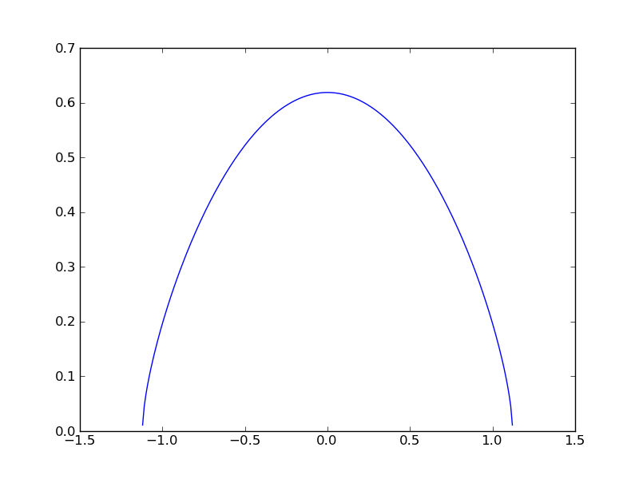
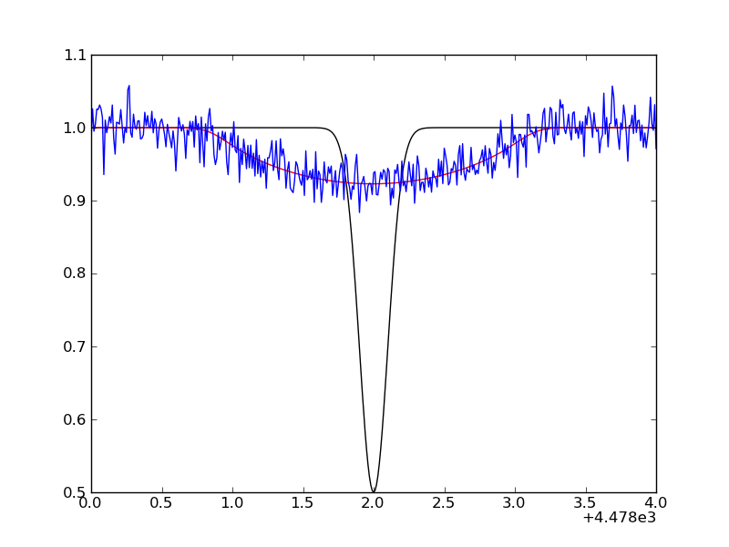
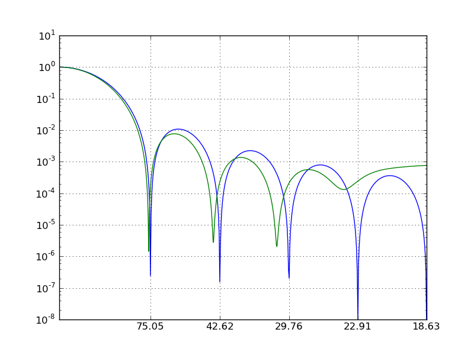

Scipy FFT
=========

.. contents::

In this tutorial, we dig a bit deeper in scipy's 1D FFT capabilities, exploring
rotational broadening in stellar spectra along the way. For a full list of
available functions, see http://docs.scipy.org/doc/scipy/reference/fftpack.html.

The flow of the programming is as follows (see, e.g., Carroll 1933, Dravins 1990,
Reiners 2001, Simon-Diaz 2006):

1. First, we construct a rotational broadening kernel assuming a linear limb-darkened star
2. We generate a synthetic spectral line, and convolve it with the kernel using ``fftconvolve``.
3. We add some noise on the spectrum.

Next, we assume we don't know the projected equatorial velocity, and derive it
from the generated spectrum, using the Fourier method. We compare an oversampled
computed Fourier transform (``fft``) with the analytical one. So the steps are:

4. Compute the ``fft`` of the generated spectrum and compare with the analytical one (of the broadening kernel only)
5. Compare the output vsini with input value.

Getting started
---------------

We need a lot of functions. First, we import the Fourier functions:

.. sourcecode:: python
    
    from scipy.fftpack import fft,fftfreq    
    from scipy.signal import fftconvolve

For the analytical computation of the Fourier transformation, Bessel functions
are required:

.. sourcecode:: python

    from scipy.special import j1

And of course the usual imports. An explicit import of ``pi``, ``sin``, ``cos``
and ``sqrt`` is done to avoid extensive use of ``np.`` which could make the code
less readable.

.. sourcecode:: python

    import pylab as plt    
    import numpy as np
    from numpy import pi,sin,cos,sqrt

To finalize the setup, we need some constants. We define them here explicitly,
but there exists a module `scipy.constants <http://docs.scipy.org/doc/scipy/reference/constants.html>`_, with an
extensive list of physical constants. However, it does not contain specifical astronomical constants such as the solar mass (see Prsa & Harmanec 2011).

.. sourcecode:: python
    
    midwave = 4480. # central wavelength of line
    cc = 2.99792458e+18 # velocity of light in angstrom/s    
    epsilon = 0.6 # linear limbdarkening parameter
    vsini = 75.*1e13 # input vsini in A/s (75 km/s)    
    dlam = 0.01 # spectrum resolution (A)
    delta = midwave*vsini/cc 

We will add some noise to a generate spectrum. To be able to reproduce the results,
we make sure that we always add the same noise, regardless of how many times
we run the script:

.. sourcecode:: python

    np.random.seed(1111)

The analytical broadening kernel
--------------------------------

The rotational broadening function *G* is only defined on a certain wavelength interval, but
we'll be lazy and solve that issue later. For now, we make the wavelength interval
broad enough, i.e. +/- 5 angstrom, using the spectral resolution given above. 

.. sourcecode:: python

    lambdas = np.linspace(-5,5,10./dlam+1) # wavelength interval
    y = 1-(lambdas/delta)**2 # transformation of wavelengths
    G = (2*(1-epsilon)*sqrt(y)+pi*epsilon/2.*y)/(pi*delta*(1-epsilon/3))  # the kernel
    print(G)

The ``sqrt`` is of course only defined for positive numbers. For negative numbers,
numpy silently fills in ``nan`` (not a number).

.. raw:: html

   
Click to Show/Hide: NOTES on ``np.nan``
 

.. note::

    * in some versions of scipy and numpy, ``nan`` is not silently introduced,
      but a warning is printed to the screen. You can avoid these print
      statements via ``np.seterr(all='ignore')``.
    * In the example, we were lazy and let the ``nan`` be introduced in the
      arrays. In general, you should be **very careful** with this behaviour,
      since many statements will silently break if there are nan's around:

      .. sourcecode:: python
        
          x = np.random.normal(size=100)    
          x.std()
          x[10] = np.nan
          np.std(x) # std is not defined when there is a nan!
      
      Some functions have an alternative that can handle nans:

      .. sourcecode:: python

          np.nanmax(x)

      but not all of them:

      .. sourcecode:: python

          hasattr(np,'nanstd'), hasattr(np,'nansum')
      
    * You might think ``np.nan`` is a good way to **mask elements in an array**,
      e.g. when you want to compute the mean of an array. However, in the
      previous note we've seen that numpy functions will return ``np.nan`` when
      used on an array containing at least on ``np.nan``. Numpy has a seperate
      array class for arrays with masked values, appropriately named **masked arrays**:

      .. sourcecode:: python
        
         x = np.random.normal(size=(4,4))
         x
         mask = x<0
         y = np.ma.array(x,mask=mask)
         y

      Notice that numpy actually uses a specific fill value for the masked values,
      usually ``1e+20``, but you can control that value. Then finally, we can use
      the normal numpy functions again:

      .. sourcecode:: python
        
         x.std(),y.std()
         x.min(),y.min()

    * ``matplotlib`` can handle ``np.nan``:

      .. sourcecode:: python
      
         X,Y = np.mgrid[-5:5:500j,-5:5:500j]
         Z = X*Y
         Z[np.sqrt((X-1)**2+(Y-2)**2)<1.] = np.nan
         plt.imshow(Z);
         plt.colorbar();
         
    .. image:: matplotlibnan.png
      :scale: 50

.. raw:: html

   

We remove all the wavelength 
and kernel elements wherever the kernel is not defined:

.. sourcecode:: python

    keep = -np.isnan(G) # returns boolean array with `False` where there are nans
    lambdas,G = lambdas[keep],G[keep] # crop the arrays not to contain nans
    lambdas.min(),lambdas.max()

The broadening kernel is only defined between -1.12 and 1.12 A. We could have
foreseen this, since

.. sourcecode:: python

    1.12/midwave*(3e5) # approximate velocity in km/s of 1.12 angstrom at 4480A

Finally make a plot of the rotational kernel.

.. sourcecode:: python

    plt.plot(lambdas,G)

The synthetic line
------------------

Suppose a line has an intrinsic Gaussian profile in absence of rotation:

.. sourcecode:: python

    wavelengths = np.arange(midwave-5,midwave+5+dlam,dlam)
    spec_line = 1-0.5*np.exp( -(wavelengths-midwave)**2/(2*0.1**2)) # width of 0.1A

This needs to be convolved with the rotational broadening kernel. Scipy (and
numpy) have a ``convolve`` function that does not use the FFT, but here we choose
to use the FFT version. We construct the new wavelength array for the convolved
spectrum, and make sure the equivalent width has not changed during the
convolution process:

.. sourcecode:: python

    spec_conv = fftconvolve(1-spec_line,G,mode='full')
    N = len(spec_conv) # equals len(spec_line)+len(G)+1 when mode='full'
    wavelengths_conv = np.arange(-N/2,N/2,1)*dlam + midwave
    EW_before = np.trapz(1-spec_line,x=wavelengths) # trapezoidal integration
    EW_after = np.trapz(spec_conv,x=wavelengths_conv)
    spec_conv = 1-spec_conv/EW_after*EW_before

.. raw:: html

   
Click to Show/Hide: NOTE on numerical integration
 

.. note::

   Scipy contains a package dedicated to integration: ``scipy.integrate``. It
   also contains the ``trapz`` function, implements the Simpson rule, and
   provides ``quad`` and ``dblquad``, that can integrate functions numerically
   between limits (i.e., without you having to specify an ``x`` and ``y``
   array):

    .. sourcecode:: ipython
        
        In [1]: from scipy.integrate import quad

        In [1]: quad(lambda t: np.exp(-t) / t**5,1,np.inf)
        Out[1]: (0.0704542374617277, 2.8164841189102693e-09)
        

   The return value is a tuple, with the first element holding the estimated
   value of the integral and the second element holding an upper bound on the
   error.
    
   The ``integrate`` package also contains an ODE solver ``odeint``. See e.g.
   the `Zombie Apocalypse example <http://www.scipy.org/Cookbook/Zombie_Apocalypse_ODEINT>`_.

.. raw:: html

   

Finally, we simulate an observed profile by adding random Gaussian noise:

.. sourcecode:: python

    spec_obs = spec_conv + np.random.normal(size=len(spec_conv),scale=0.02)

A plot of the unbroadened (black) and broadened line (red/blue) can be made with:

.. ipython::

    plt.figure(10);    
    plt.plot(wavelengths,spec_line,'k-');    
    plt.plot(wavelengths_conv,spec_conv,'r-');
    plt.plot(wavelengths_conv,spec_obs,'b-');    
    plt.xlim(4478,4482)

The analytical Fourier transform
--------------------------------

Let's get back to the rotational kernel. The analytical Fourier transform is
easily computed. First, we need to define the domain in frequency space on which
to compute the transform, and then we evaluate it. Note the use of scipy's
Bessel function:

.. sourcecode:: python

    x = np.linspace(0,30,1000)[1:]  # exclude zero    
    g = 2. / (x*(1-epsilon/3.)) * ( (1-epsilon)*j1(x) +  epsilon* (sin(x)/x**2 - cos(x)/x))
    g = g**2 # convert to power

.. sourcecode:: python

    x /= (2*pi*delta)
    

Computing the Fourier transform
-------------------------------

When calculating the FFT with ``fft``, a complex array is returned. You can get
the real and imaginary part with ``y.real`` and ``y.imag``, and the norm and 
phase angle via ``np.abs(y)`` and ``np.angle(y)``. In this case,
we are only interested in the power. Also, we need to increase the frequency
resolution of the Fourier transform, so that we can nicely resolve the zeros.
This is done via zero padding, and there exists and optional keyword ``n`` to
the function ``fft`` to do just that. If you do not specify ``n``, ``n`` equals
the length of the input array, otherwise the input array is zero-padded until
it is of size ``n``. We choose to make our input array 100 times larger. Finally,
the Fourier method is sensitive to noise outside of the spectral line region.
Therefore, we cut the spectrum to have little continuum remaining.

.. sourcecode:: python

    keep = np.abs(midwave-wavelengths_conv)<1.2 # minimize contribution of continuum
    spec_to_transform = (1-spec_obs)[keep] # we need the continuum at zero
    new_n = 100*len(spec_to_transform) # new length for zeropadding    
    spec_fft = np.abs(fft(spec_to_transform,n=new_n))**2 # power of FFT

The domain of the Fourier transform is retrieved via ``fftfreq``, but we exclude
the negative frequencies:
    
.. sourcecode:: python
    
    x_fft = fftfreq(len(spec_fft),d=dlam)    
    keep = x_fft>=0 # only positive frequencies    
    x_fft, spec_fft = x_fft[keep], spec_fft[keep]

Measuring the vsini
-------------------

The measured vsini corresponds to the first zero in the Fourier transform. Due
to discretization and noise, zero will never be reached, so we need to look for
local minima: those are the locations where the first derivative switches sign
from negative to positive:

.. sourcecode:: python
    
    neg_to_pos = (np.diff(spec_fft[:-1])<=0) & (np.diff(spec_fft[1:])>=0)
    minima = x_fft[1:-1][neg_to_pos]

Let's compare that to the minima from the analytical transform:

.. sourcecode:: python
    
    neg_to_pos = (np.diff(g[:-1])<=0) & (np.diff(g[1:])>=0)
    minima_an = x[1:-1][neg_to_pos]

The frequency domain can be converted to velocity (km/s) as follows:

.. sourcecode:: python

    q1 = 0.610 + 0.062*epsilon + 0.027*epsilon**2 + 0.012*epsilon**3 + 0.004*epsilon**4        
    vsini_zeros = cc/midwave*q1/minima/1e13 
    vsini_zeros_an = cc/midwave*q1/minima_an/1e13

The first zero should be the input vsini:

.. sourcecode:: python

    print(vsini_zeros_an[:10])
    print(vsini_zeros[:10])

Finally, we can make a nice plot: We use the s/A scaling on the x-axis, but
set the tickmarks to correspond to km/s.

.. sourcecode:: python
    
    plt.figure();    
    plt.plot(x,g/g.max());    
    plt.plot(x_fft,spec_fft/spec_fft.max());    
    plt.gca().set_yscale('log');    
    plt.xlim(0.0,0.05);    
    plt.ylim(1e-8,1e1);    
    plt.grid();    
    plt.xticks(minima_an[:5]*midwave/q1/cc*1e13,['{0:.2f}'.format(i) for i in vsini_zeros_an[:5]])

