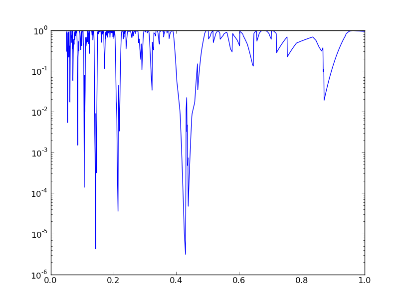

Scipy stats
===========

.. contents::
    
Scipy contains a library with statistical functions, distributions and tests,
called ``scipy.stats``. In this example, we will explore some of the possibilities it offers, tackling the following problem from asteroseismology
of sdB stars (see e.g. Kawaler 1988):
    
    Due to the interior structure of an sdB star, we expect long pulsation
    periods to follow an equidistant pattern (i.e., a period spacing). The
    value of the period spacing tells us more about the extent of the core and
    the envelope.
    
A complication is that often, not only periods from a period spacing are
observed, but also other frequencies, e.g. due to rotational splitting. So
given a list of observed periods, we need to find the value of the period spacing, and perhaps test whether it is significant.

We use two approaches to this problem:
    
    * Following Kawaler 1988, we perform the Kolmogorov-Smirnov test to see
      whether a certain period spacing is significant. Doing this for a lot of
      trial period spacings, we can make some kind of *periodogram*.
    * We run over a grid of possible periods, and compute the chi-square
      statistic for every trial period (and offset).
      
The second strategy is incredibly crude, and, scientifically, not really the
way to go. However, it allows us to use the chi-square distribution implemented
in scipy to derive confidence intervals on the period spacing (and offset).

Setup
-----

To explore this problem, we will simulate an observed set of period spacings,
and add some noise to them.

First, we need to do the usual imports:
    
.. sourcecode:: python

    import numpy as np    
    import pylab as plt    
    from numpy import pi    
    import scipy.stats
    
Now, generate 8 almost equidistant spacings, and add  3 random ones periods mixed with the equidistant structure. We fix the seed to be able to reproduce
the results:
    
.. sourcecode:: python

    np.random.seed(1111)    
    periods = 1.23 + np.arange(8)*0.43 # the spacing and offset
    periods += scipy.stats.norm.rvs(size=len(periods),scale=0.005) # add normal noise    
    periods = np.hstack([periods,scipy.stats.uniform.rvs(size=3,loc=1.23,scale=3)]) # mix with 3 others    
    periods.sort()
    
Note that we could have used the ``np.random`` module too to generate the
random variables. However, the ``scipy.stats`` module contains much more
distributions and many more options. For every statistical distribution, you can

* generate random variables with ``.rvs()``
* compute the probability density function with ``.pdf()``
* compute the cumulative density function with ``.cdf()``
* ... and much more

This is a list of spacings we want to test:

.. sourcecode:: python
    
    test_spacings = np.linspace(0.05,1,1000)

The Kolmogorov-Smirnov test
---------------------------
    
The following few lines of codes closely follow Kawaler (1988). Since this is
not a tutorial on statistics, we refer to that paper for more information.

We choose the shortest period to compare with, and remove it from the list of
periods.

.. sourcecode:: python
    
    index_short = np.argmin(periods)    
    p_short = periods[index_short]    
    periods_del = np.delete(periods,index_short)

Then, we calculate the distribution of the periods compared to the tested
spacing:

.. sourcecode:: python
    
    dp = []    
    for dp_test in test_spacings:
        ri = []
        for pi in periods_del:
            ni = (pi-p_short)/dp_test
            ri.append(ni-np.floor(ni))
        dp.append(ri)
    

Next, we use the **Kolmogorov-Smirnov** test to derive whether the ``ri`` come
from a uniform distribution. We do this for every test spacing:
    
.. sourcecode:: python
    
    Q = np.zeros(len(dp)) 
    for i,ri in enumerate(dp):
        ksstat,pvalue = scipy.stats.kstest(ri,'uniform')
        Q[i] = pvalue # we're only interested in the pvalue, not the KS statistic    
    
        
In principle, we should now correct for the number of trial periods (the
Bonferroni correction, but we omit that step here. Finally, we can make a plot:

.. sourcecode:: python
    
    plt.figure()    
    plt.plot(test_spacings,Q)    
    test_spacings[np.argmin(Q)]
    

A Chi-square approach
---------------------
    
The chi-square approach requires us to check a set of predicted period spacings,
which all have their own offset value and period spacing, against the observed
set of period spacing. We will make the huge assumption that we already know
that we have 8 periods within a period spacing.

We have to cycle over all the possibilities, build the set of period spacing,
and match them with the closest values in the set of observed periods (we do not
care about the three random ones, but we do not know which ones the are).

Let us first make a search grid:

.. sourcecode:: python
    
    test_offset = np.linspace(1.2,1.25,500)
    test_spacings = np.linspace(0.3,0.5,500)
    
And prepare for the computation of the chi-square statistic. We have 8 periods
to match and free parameters, so we need to set ``k=8-2=6`` in the chi-square
distribution:
    
.. sourcecode:: python
    
    chi2 = np.zeros((len(test_offset),len(test_spacings)))
    k = 8-2

Next, we run over the grid and compute the chi-square statistic, which is
defined as the sum of the residuals-squared divided by the error-squared:
    
.. sourcecode:: python
    
    for i,to in enumerate(test_offset):        
        for j,ts in enumerate(test_spacings):
            test_periods = to+np.arange(8)*ts
            periods_ = periods[:-1] + np.diff(periods)/2.
            closest_index = np.searchsorted(periods_,test_periods)
            chi2[i,j] = np.sum((periods[closest_index]-test_periods)**2/0.005**2)
        

Using ``scipy.stats``, we can compute the cumulative density of the chi-square
value, which corresponds to some kind of confidence rating:

.. sourcecode:: python
    
    chi2_stat = scipy.stats.distributions.chi2.cdf(chi2,k)        

That's it! All is left is to make some plots: we choose to make a plot of the
chi-square values themselves (left), and a plot of the confidence intervals (right).

.. sourcecode:: python

    plt.figure()    
    plt.subplot(121)
    extent = test_spacings.min(),test_spacings.max(),test_offset.max(),test_offset.min()    
    plt.imshow(chi2,aspect='auto',extent=extent,vmin=10,vmax=3000,cmap=plt.cm.spectral)    
    plt.colorbar()    
    plt.subplot(122)
    plt.imshow(chi2_stat*100,aspect='auto',extent=extent,cmap=plt.cm.spectral)
    plt.plot(0.43,1.23,'x',ms=40,mew=4,color='1')
    plt.xlim(0.425,0.434)    
    plt.ylim(1.24,1.212)    
    cbar = plt.colorbar()    
    cbar.set_label('Confidence interval (%)')

    
.. image:: ks_chi2.png
  :scale: 50
