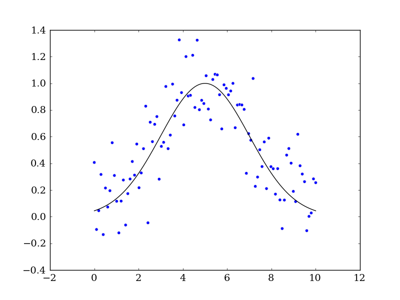
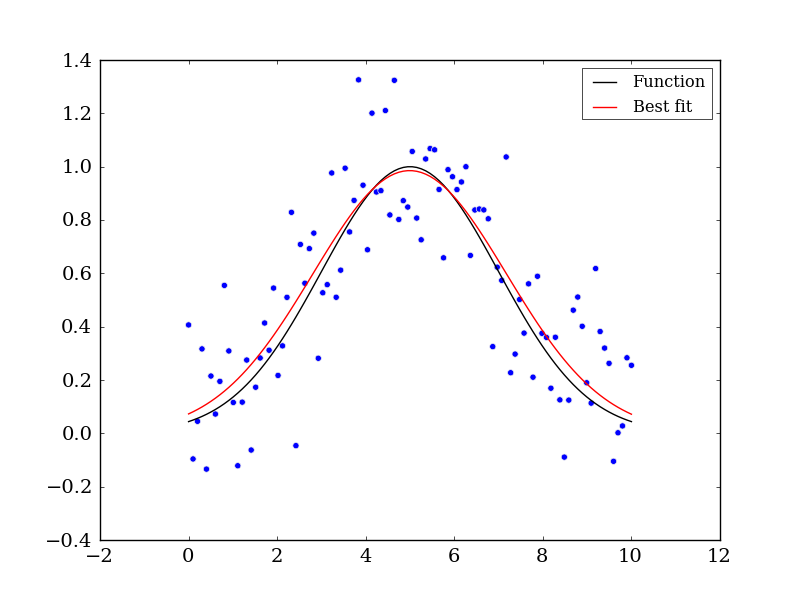
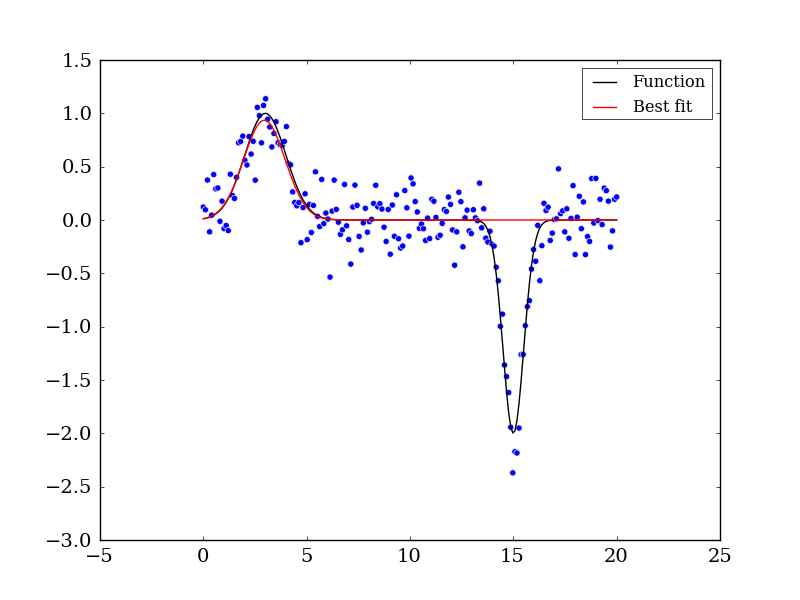

2D Examples and Exercise
========================

Similar to the 1D examples we'll see how using curve_fit works for 2D Gaussians to parameterize resolved sources, e.g. nearby prestellar cores

Simple Gaussian
---------------
Let's begin with a simple Gaussian problem. We will generate fake data first and compare it to the `real` data::

    import numpy as np
    from scipy.optimize import curve_fit
    import matplotlib.pyplot as mpl

    # Let's create a function to model and create data
    def func(x, a, x0, sigma):
        return a*np.exp(-(x-x0)**2/(2*sigma**2))

    # Generating clean data
    x = np.linspace(0, 10, 100)
    y = func(x, 1, 5, 2)

    # Adding noise to the data
    yn = y + 0.2 * np.random.normal(size=len(x))

    # Plot out the current state of the data and model
    fig = mpl.figure()
    ax = fig.add_subplot(111)
    ax.plot(x, y, c='k', label='Function')
    ax.scatter(x, yn)
    fig.savefig('model_and_noise.png')

Let's now use `curve_fit` function to see how well we can reconstruct the the data's original form before noise was added::

    # Executing curve_fit on noisy data
    popt, pcov = curve_fit(func, x, yn)

    #popt returns the best fit values for parameters of the given model (func)
    print popt

    ym = func(x, popt[0], popt[1], popt[2])
    ax.plot(x, ym, c='r', label='Best fit')
    ax.legend()
    fig.savefig('model_fit.png')

Multiple Gaussian
-----------------

The optimization function `curve_fit` seems quite simple to use. When using it with simple and clean situations as shown above it can excel quite nicely. But, what about when there's multiple Gaussian peaks and dips (i.e. emission and absorption) in a dataset?::

    import numpy as np
    from scipy.optimize import curve_fit
    import matplotlib.pyplot as mpl

    # Let's create a function to model and create data
    def func(x, a, x0, sigma):
        return a*np.exp(-(x-x0)**2/(2*sigma**2))

    # Generating clean data
    x = np.linspace(0, 20, 200)
    y1 = func(x[np.where(x <= 10)], 1, 3, 1)
    y2 = func(x[np.where(x > 10)], -2, 15, 0.5)

    y = np.hstack([y1, y2])

    # Adding noise to the data
    yn = y + 0.2 * np.random.normal(size=len(x))

    # Plot out the current state of the data and model
    fig = mpl.figure()
    ax = fig.add_subplot(111)
    ax.plot(x, y, c='k', label='Function')
    ax.scatter(x, yn)
    fig.savefig('model_and_noise_multiple.png')

    # Executing curve_fit on noisy data
    popt, pcov = curve_fit(func, x, yn)

    #popt returns the best fit values for parameters of the given model (func)
    print popt

    ym = func(x, popt[0], popt[1], popt[2])
    ax.plot(x, ym, c='r', label='Best fit')
    ax.legend()
    fig.savefig('model_fit_multiple.png')
    

.. admonition::  Exercise 1

    Using the code from above utilize the ``help`` or ``?`` functionality in ``ipython`` to figure out how fit the dip. Otherwise, you can always refer to the online documentation for `curve_fit <http://docs.scipy.org/doc/scipy/reference/generated/scipy.optimize.curve_fit.html>`_.
    
    to reproduce (within reason) the image below. Additionally, using the tabbing feature to see what other methods are available is key for this exercise. Use the `Quick Reference Guide <http://aplpy.github.com/documentation/quick_reference.html>`_ for other information that may be helpful.
    
Hint: It's all about the initial parameters.

    
Click to Show/Hide Solution
 

Use the optional parameter p0 for the initial conditions::

    popt, pcov = curve_fit(func, x, yn, p0=[-1,15,1])
    
.. raw:: html

    

  
