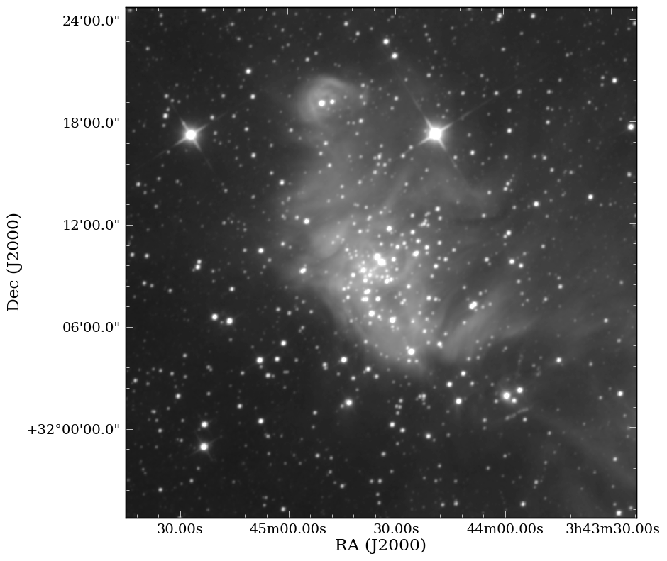
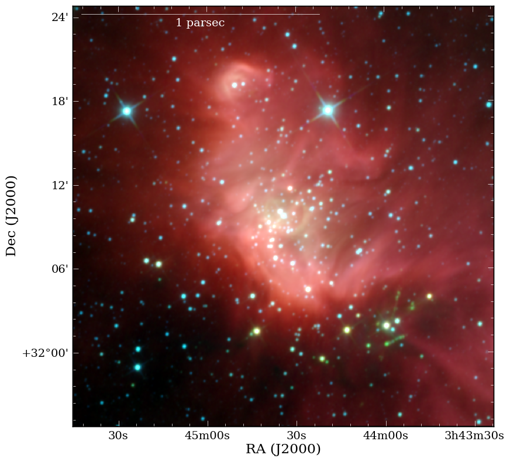
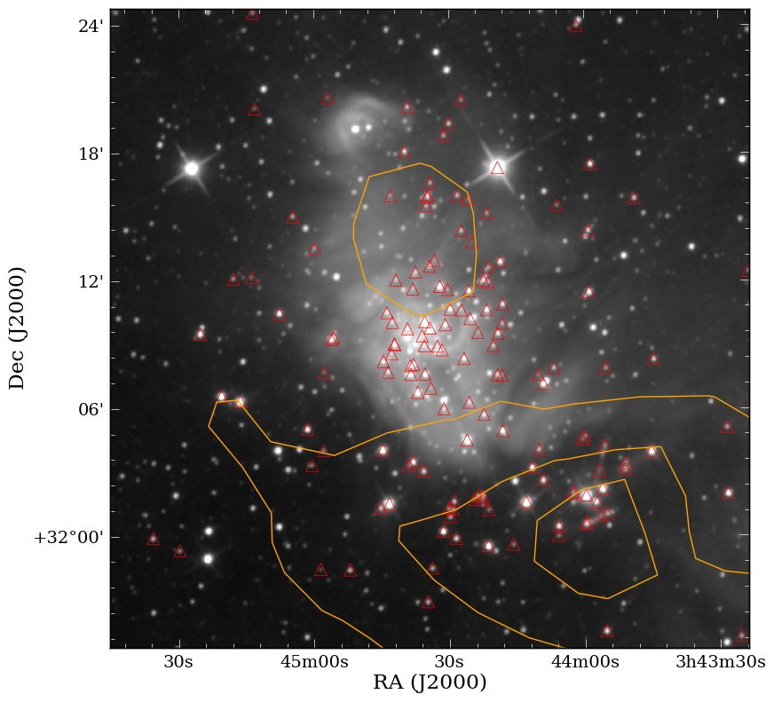
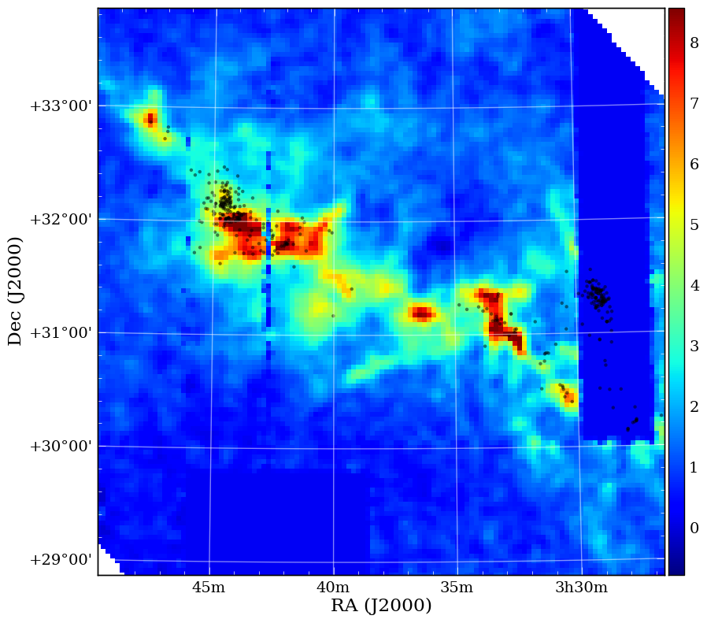

APLpy
======

`APLpy <http://aplpy.github.com>`_ (the Astronomical Plotting Library in Python) is a Python module aimed at producing publication-quality plots of astronomical imaging data in FITS format. It effectively provides a layer on top of Matplotlib to enable plotting of Astronomical images, and allows users to:

* Make plots interactively or using scripts
* Show grayscale, colorscale, and 3-color RGB images of FITS files
* Generate co-aligned FITS cubes to make 3-color RGB images
* Overlay any number of contour sets
* Overlay markers with fully customizable symbols
* Plot customizable shapes like circles, ellipses, and rectangles
* Overlay ds9 region files
* Overlay coordinate grids
* Show colorbars, scalebars, and beams
* Easily customize the appearance of labels and ticks
* Hide, show, and remove different contour and marker layers
* Pan, zoom, and save any view as a full publication-quality plot
* Save plots as EPS, PDF, PS, PNG, and SVG

Documentation
-------------

The APLpy `Documentation <http://aplpy.github.com/documentation/index.html>`_ contains all the information needed to run APLpy successfully. The most important page is the `Quick Reference Guide <http://aplpy.github.com/documentation/quick_reference.html>`_ which provides concise instructions for all of the APLpy functions.

When things go wrong
--------------------

* Team up with someone for now. We can fix the installation errors afterward. The basic modules are aplpy, pywcs and pyfits (beyond NumPy and Matplotlib). The cool, but not required modules are pyregion, PIL, python-montage (Montage from IRSA will be needed). 

* If you run into what you believe is a bug, please report it at the GitHub `Issue Tracker <https://github.com/aplpy/aplpy/issues>`_.

Getting started
---------------

Start off by downloading :download:`this tar file <../downloads/ic348_wise.tar>`, expand it, and go to the ``ic348_wise`` directory on the command line. Then, launch pylab::

    $ ipython --pylab

If you have trouble downloading the file, then start up IPython (``ipython -pylab``) and enter::

    import urllib2, tarfile
    url = 'http://python4astronomers.github.com/_downloads/ic348_wise.tar'
    tarfile.open(fileobj=urllib2.urlopen(url), mode='r|').extractall()
    cd APLpy-example
    ls

Import the ``aplpy`` module (note the lowercase module name)::

    import aplpy

And create a new figure to plot the FITS file with::

    # Launch APLpy figure of image
    img = aplpy.FITSFigure('w1.fits')

    # Apply grayscale mapping of image
    img.show_grayscale()

    # Or apply a different stretch to the image
    img.show_grayscale(stretch='arcsinh')

    # Specifically specify lower and upper limit
    img.show_grayscale(stretch='arcsinh', vmin=1, vmax=290)

    # Display a grid and tweak the properties
    img.show_grid()

    # Modify the tick labels for precision and format
    img.tick_labels.set_xformat('hhmm')
    img.tick_labels.set_yformat('ddmm')

    # Move the tick labels
    img.tick_labels.set_xposition('top')
    img.tick_labels.set_yposition('right')
    img.save('ic348_basic.eps')

The latter is recommended because it will automatically figure out the best resolution with which to output your plot. Your plot should look something like this:

Now let's do something a bit more advanced where we'll make a color image from the fits files and plot some extra features on top of it. If you cannot get Montage and python-montage installed, then you can use the already produced files to follow along with the exercise::
    
    import aplpy

    # Make RGB cube - images do not need not to have the same WCS
    aplpy.make_rgb_cube(['w3.fits','w2.fits','w1.fits'], 'cube.fits')

    # Make RGB image - you can specify color parameters here
    aplpy.make_rgb_image('cube.fits','rgb_image_linear.png')

    # Customize it
    aplpy.make_rgb_image('cube.fits','rgb_image_arcsinh.png', 
                          stretch_r='arcsinh', stretch_g='arcsinh', 
                          stretch_b='arcsinh')

    # Launch APLpy figure of 2D cube
    img = aplpy.FITSFigure('cube_2d.fits')
    img.show_rgb('ic348_color_linear.png')

    # Maybe we would like the arcsinh stretched image more?
    img.show_rgb('ic348_color_arcsinh.png')

    # Modify the tick labels for precision and format
    img.tick_labels.set_xformat('hhmmss')
    img.tick_labels.set_yformat('ddmm')

    # Let's add a scalebar to it
    img.add_scalebar(5/60.)
    img.scalebar.set_label('5 arcmin')
    img.scalebar.set_color('white')

    # We may want to lengthen the scalebar, move it to the top left, 
    # and apply a physical scale
    img.scalebar.set_corner('top left')
    img.scalebar.set_length(17/60.)
    img.scalebar.set_label('1 parsec')
    img.save('ic348_color_arcsinh.pdf')

Your final color plot should look something like this:

We're ready at this point to start making science-grade plots with APLpy with contours and markers::

    import aplpy, atpy

    # Launch APLpy figure of image
    img = aplpy.FITSFigure('w2.fits')

    # Apply grayscale mapping of image
    img.show_grayscale()

    # Or apply a different stretch to the image
    img.show_grayscale(stretch='arcsinh')

    # Specifically specify lower and upper limit
    img.show_grayscale(stretch='arcsinh', vmin=10, vmax=180)

    # Modify the tick labels for precision and format
    img.tick_labels.set_xformat('hhmmss')
    img.tick_labels.set_yformat('ddmm')

    # ATpy to pull in sources
    # If you want to see what columns are available - type t.describe()
    t = atpy.Table('per_ysoc_c2d.fits')

    # Now, let's display the young stellar objects (YSOs) in the region 
    # using c2d Spitzer data
    img.show_markers(t.ra, t.dec) 

    # But let's make the markers bigger and triangles instead
    # Before we can do that we need to list the layers
    img.list_layers()
    img.remove_layer('marker_set_1')

    # Now we add the new markers
    img.show_markers(t.ra, t.dec, marker='^', s=100)

    # Let's add a contour from Av map of the region from COMPLETE Survey
    img.show_contour('per_extn2mass.fits', levels=[8,7,6,5,4], colors='green')
    img.save('ic348_marker_contour.png')
    
The science-grade plot should look something like this:

.. admonition::  Exercise 1

    Use the  ``help`` or ``?`` functionality in ``ipython`` to figure out how to reproduce (within reason) the image below. Additionally, using the tabbing feature to see what other methods are available is key for this exercise. Use the `Quick Reference Guide <http://aplpy.github.com/documentation/quick_reference.html>`_ for other information that may be helpful.

.. raw:: html
    
    
Click to Show/Hide Solution
 

    
import aplpy
import atpy

# Exercise

img = aplpy.FITSFigure('per_av_j2000.fits')

# Identical to show_grayscale
img.show_colorscale()

# Recenter the image with a defined width of 5 degrees
img.recenter(54.51, 31.39, radius=2.5)

# Show the grid
img.show_grid()

# Define tick label style
img.tick_labels.set_xformat('hhmm')
img.tick_labels.set_yformat('ddmm')

img.show_colorbar()

# Read in table using atpy
t = atpy.Table('per_ysoc_c2d.fits')

# Plot markers 
img.show_markers(t.ra, t.dec, facecolor='black', edgecolor='none', s=20)

img.save('ic348_av_markers.png')

.. raw:: html

