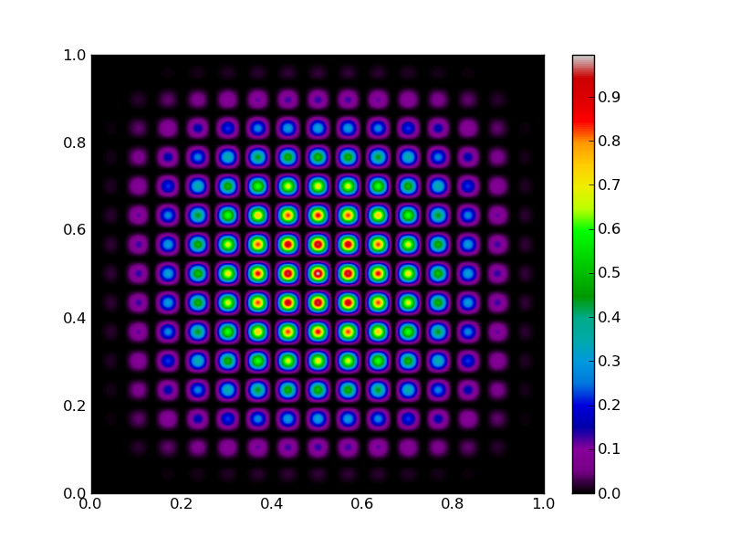

Random-point crossover genetic algorithm with demo GUI
======================================================

In this tutorial we write a code that implements a simple genetic algorithm to
find a maximum of a function, *and* construct a graphical user interface around it
to visualise the program. We will use about *as many lines of codes as there
letters in the title of this tutorial*. Granted, for clarity, some single-line
statement should be expanded in multi-line statements, though I personally feel
the code is not particularly obfuscated.

.. contents::

A simple genetic algorithm
--------------------------

Typically, a genetic algorithm has the following ingredients, introducing some
terminology along the way:
    
    1. A function that needs to be maximized
    2. A function that returns the *fitness* of a set of parameters (*individual* from a *population*)
    3. A function that generates a new individual starting from other individuals
    (*child* from *parents* via a *breeding mechanism*)
    4. A function that selects *fit* individuals (i.e. individuals with a high
    fitness) for breeding

First, as always, the necessary import statements:

.. sourcecode:: python

    import pylab as plt
    import numpy as np

Let's introduce the fitness function that needs so be maximized. We choose 2D function
with a lot of local maxima:

.. sourcecode:: python

    def maxfunc(sample):
        x,y = sample
        return (16.*x * (1-x) * y * (1-y) * np.sin(15.*np.pi*x) * np.sin(15.*np.pi*y))**2

Suppose we have a population consisting of a lot of individuals, and we have
a fitness value for all of them. We might want to rank the individuals according
to their fitness. The function returns the sorted sample and the cumulative
fitness. Using the latter, we can later on choose to keep a fraction of a given
population for further breeding:

.. sourcecode:: python
    
    def rank(sample,fitness):
        fitness /= np.sum(fitness) # normalize fitness values
        sa = np.argsort(fitness) # sort the sample
        return sample[sa],np.cumsum(fitness[sa])

The 'good' individuals are chosen to be a random fraction (but at the most 10%)
of the original population. Of course if we choose e.g. 10% of the population,
we will choose the 10% fittest individuals:

.. sourcecode:: python

    def select_individuals(acfitness,min_value=0.9):
        return (acfitness>min(np.random.uniform(),min_value))

Next up, is a breeding function. We use a random point crossover mechanism
(i.e., if there are ``n`` parameters, we choose the first ``n1`` parameters of
parent 1 and the last ``n-n1`` parameters of parent2 to generate a new individual.
This is a bit overkill in 2D, since ``n1=1`` always:

.. sourcecode:: python

    def breed_crossover(parent1,parent2,parents):
        index = int(np.random.uniform(low=1,high=len(parent1)-1)) # random point between 1 and 1 is always 1
        return np.hstack([parent1[:index],parent2[index:]])

Given a population, we know now which individuals are good enough to be parents,
and we know how to breed having parents. Thus, we can generate some offspring. In
doing so, we add another random event: we randomly choose parents from the population
to breed with (determined with ``index1`` and ``index2`` below):

.. sourcecode:: python

    def generate_offspring(sample,good_individuals,breed_func):
        parents = sample[good_individuals] # select only good individuals
        nr_of_children = np.sum(-good_individuals) # how many individuals need to be replaced?
        Np,Ni = parents.shape
        children = np.zeros((nr_of_children,Ni)) # prepare to fill in the children
        index1 = np.array(np.random.uniform(size=nr_of_children,high=Np-1).round(),int) # random parent 1
        index2 = np.array(np.random.uniform(size=nr_of_children,high=Np-1).round(),int) # random parent 2
        for nr,(i,j) in enumerate(zip(index1,index2)):
            children[nr] = breed_func(parents[i],parents[j],parents)
        return children

A function that accepts an 'old' population and evolves it to a 'new' generation
is then straightforwardly implemented with:

.. sourcecode:: python

    def evolve(sample,eval_func,breed_func):
        fitness = eval_func(sample.T) # evaulation function needs 2xN instead of Nx2
        sample,fitness_ = rank(sample,copy.copy(fitness))
        good,bad = select_individuals(sample,fitness_)
        children = generate_offspring(sample,good,breed_func)
        sample[bad] = children
        return sample

That's it, using 31 lines of code. We could know generate an initial population and let it evolve by
iteratively calling ``evolve`` on the population.

We have about 20 lines of code left to construct an interactive GUI. 

A simple GUI
------------

Luckily, ``matplotlib`` *already* has a GUI. By just calling ``plt.show()``, a
main window is created and an event loop is started. All we need to do is add
some functionality. This is the list of features we will implement in the GUI:

    * the user should be able to change the number of individuals in the population
      via a Slider widget.
    * the user should be able initialise the sample with the keyboard button ``i``.
    * the user should be able to evolve the populations hitting ``enter``.

Each time the user hits ``i``, the function that needs to be maximized has to be
shown to the screen, as well as the initial population. Hitting ``enter`` should
remove the old population, evolve it and show the new population.

Let's start with the keyboard events. We construct a function called ``ontype``,
which receives a keyboard event from the GUI. This event has an attribute ``key``,
which is a string corresponding to the button the user just pressed. If ``key``
equals ``i`` or ``enter``, we need to do something. Otherwise, the function should
exit quitely.

.. sourcecode:: python

    def ontype(event):
    
        if event.key=='enter':
            #-- retrieve the sample data from the plot: the sample is plotted in white
            for child in plt.gca().get_children():
                if hasattr(child,'get_color') and child.get_color()=='1':
                    sample = np.array(child.get_data()).T # put it in the right format
                    break # make sure `child` is now set to the right artist
            sample,fitness = evolve(sample,maxfunc,breed_crossover)
            child.set_data(sample[:,0],sample[:,1])
        
        if event.key=='i':
            sample = np.random.uniform(size=(slider.val,2),low=0,high=1) # initialize sample
            bkg = maxfunc(np.mgrid[0:1:500j,0:1:500j]) # make the background
            plt.cla()
            plt.plot(sample[:,0],sample[:,1],'o',color='1',mec='1')
            plt.imshow(bkg,extent=[0,1,0,1],aspect='auto',cmap=plt.cm.spectral)
            plt.gca().set_autoscale_on(False)
        
        plt.draw()

Notice how the function uses the object-oriented interface to ``matplotlib``.
Using ``get_children()`` on the current axis (``plt.gca()``), allows to cycle
through all the elements that are in the plot. We look for a particular element
that has a white color. Because not all elements in a plot *have* colors, we need
to check if the particular element has an attribute called ``color`` first. Since there
are only very few elements in the plot in this example, we can safely assume
that whatever is white, is representing
the population. We retrieve the coordinates of the individuals with ``get_data()``,
which returns the ``x`` and ``y`` coordinate arrays. Having what we want, we
break the loop. After evolving, we update the values of the plot element representing
the new population with ``set_data``.

Initialisation is a bit simpler: we only generate a random set of parameters
in the right domain and make the background function. The value for the number
of parameters is taken from the slider widget, which we construct later on.
For plotting, we first
make sure the axes is cleared (``cla()``), then plot the sample as white dots
and add the background. We set ``autoscale`` to ``False`` so that the axis limits
stay the same regardless of what we plot (if one of the individuals lies on the edges,
there might be an automatic rescaling otherwise).

Finally, we need to force a ``draw`` statement. When something is added to the
canvas, it is not automatically rendered. Rendering is an expensive operation,
so matplotlib chooses to only render stuff when explicitly needed.

This took about 16 lines of code. We can only use about 5 more to make the
slide widget and build the GUI.
    
.. sourcecode:: python

    if __name__ == "__main__":            
        axpop = plt.axes([0.20, 0.05, 0.65, 0.03], axisbg='lightgoldenrodyellow') # axis for the slide
        slider = plt.Slider(axpop, 'Population', 10, 2000, valinit=500) # the slider
        ax1 = plt.axes([0.1,0.15,0.85,0.77]) # main axis to plot the results
        
        plt.gcf().canvas.mpl_connect('key_press_event',ontype) # connect the ontype function to the GUI
        plt.show() # show the window

Here, we made a new Slider axes and initiated the main axes used to plot all the
results to. Then, we connected the ``ontype`` function to the current figure (``plt.gcf()``)
and showed the main window to the screen.

The first line in statement (``if __name__=="__main__"``) makes sure that this
part of the code is only executed when run in the terminal with::

    $:> python ga.py

We wrote quite some functions that we might want to use in other scripts as well.
Then we could simply do an ``import ga``, in which case all the code that comes
after ``if __name__=="__main__"`` will not be executed.

That's still 2 lines to spare!

This is the output from an example run:

+------------------------------------+-----------------------------------+
| .. image:: ga_init.png             | .. image:: ga_2.png               |
|    :scale: 50                      |    :scale: 50                     |
+------------------------------------+-----------------------------------+
| .. image:: ga_3.png                | .. image:: ga_4.png               |
|    :scale: 50                      |    :scale: 50                     |
+------------------------------------+-----------------------------------+
| .. image:: ga_5.png                | .. image:: ga_6.png               |
|    :scale: 50                      |    :scale: 50                     |
+------------------------------------+-----------------------------------+
| .. image:: ga_7.png                | .. image:: ga_8.png               |
|    :scale: 50                      |    :scale: 50                     |
+------------------------------------+-----------------------------------+
| .. image:: ga_9.png                | .. image:: ga_10.png              |
|    :scale: 50                      |    :scale: 50                     |
+------------------------------------+-----------------------------------+
| .. image:: ga_11.png               |                                   |
|    :scale: 50                      |                                   |
+------------------------------------+-----------------------------------+