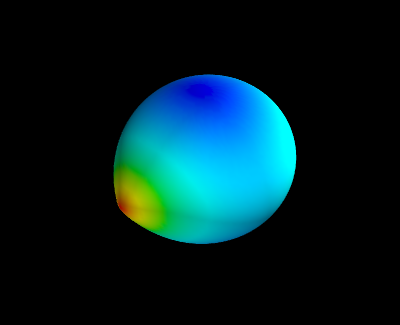
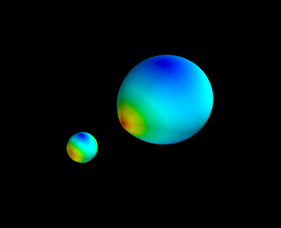

: tocdepth: 2

3D plotting with Mayavi
=======================

.. contents::

Introduction
------------

Mayavi is general 3D visualisation tool, for which python wrappers are available.
There are a lot of parallels between matplotlib and mayavi:

    * there exists huge object-oriented library, allowing you to control even the smallest detail in a plot.
    * there exists a module around that library called ``mlab``, similar (and in fact inspired by) ``pylab``.

There are of course differences too. An advantage of ``mlab`` over ``pylab`` is
its visualisation tool: the interactive display is *much* faster working in 3D
than ``pylab``'s 3D toolkit. A disadvantage of ``mlab`` is that it is much more
difficult to make publication quality plots. 

A binary system
---------------

In this example we'll try to reproduce the shapes of stars in a close binary
system, one of which almost fills its Roche lobe. We will use ``mlab`` and
``pylab`` to visualise the shapes.

The code
--------

First, we need to import some stuff: numpy, pylab and of course mlab. Also,
we need an optimizer, because there is no analytical representation of the Roche
surface. We will use the Newton-Raphson gradient method from SciPy's suite of
optimizers.

.. ipython::

    In [2]: import numpy as np

    In [2]: from numpy import sin,cos,pi,sqrt # makes the code more readable

    In [2]: import pylab as plt

    In [1]: from mayavi import mlab
    
    In [2]: from scipy.optimize import newton
    
SciPy's optimizers usually need a function that returns the residuals of a fitting
function. In this case, we want to fit the Roche surface (let us simplify it to
a circular, synchronized system). We will use spherical coordinates, and assume
that we want to find the radius ``r`` given the colatitude ``theta`` and longitude
``phi``. The fit-parameter ``r`` needs to be the first argument to the function,
the order of the other parameters is not important.

.. ipython::

    In [1]: def roche(r,theta,phi,pot,q): 
    
    @suppress
    In [1]:     from numpy import cos,sin,sqrt

    In [1]:     lamr,nu = r*cos(phi)*sin(theta),cos(theta) 
    
    In [1]:     return (pot - (1./r  + q*( 1./sqrt(1. - 2*lamr + r**2) - lamr)  + 0.5*(q+1) * r**2 * (1-nu**2) )) 
    
    In [1]:     

Next, we generate a grid in colatitude and longitude. We take 75 points in the
colatitudinal direction (between 0 and pi), and 150 points in the longitudinal
direction (between 0 and 2pi, but we shift the zeropoint with pi/2 to make nicer
plots later on).

.. ipython::
    
    In [1]: theta,phi = np.mgrid[0:np.pi:75j,-0.5*pi:1.5*np.pi:150j]

The Roche lobe filling star has a potential value of 2.88, the companion is smaller
and has a potential of 10. The Roche lobe filling star is twice as massive as the
secondary.

.. ipython::

    In [1]: pot1,pot2 = 2.88,10.

    In [2]: q = 0.5

We need a good starting value to start the Newton-Raphson method so
that it can descend to the true value. We could do that by first checking what
the expected shape of the star is. However, since the Roche potential behaves well,
we can be lazy and choose a value very close to (but not equal to) 0. We take an
arbitrary 0.00001. 

.. ipython::

    In [3]: r_init = 1e-5

Next, we need to iterate over all coordinates ``theta`` and ``phi``, and apply
the Newton-Raphson method to find the radius (slow!). We constructed a two
dimensional grid of coordinates, which is a bit anoying to iterate over (though
possible for sure!). In this approach, we make the colatitude and longitude
1D dimensional first, and iterate simultaneously over ``theta`` and ``phi``:

.. ipython::

    In [1]: r1 = [newton(roche,r_init,args=(th,ph,pot1,q)) for th,ph in zip(theta.ravel(),phi.ravel())]
    
    In [1]: r2 = [newton(roche,r_init,args=(th,ph,pot2,1./q)) for th,ph in zip(theta.ravel(),phi.ravel())]

The approach with list-comprehension implies that we need to convert the radii for
both components explicitly to an array type, and we reshape it to match the
original shape of ``theta`` and ``phi``:
    
.. ipython::
    
    In [1]: r1 = np.array(r1).reshape(theta.shape)

    In [1]: r2 = np.array(r2).reshape(theta.shape)

That's basically it! We did everything in spherical coordinates because that is
most natural in this case. To plot, however, we need cartesian coordinates:

.. ipython::
    
    In [1]: x1 = r1*sin(theta)*cos(phi)

    In [1]: y1 = r1*sin(theta)*sin(phi)

    In [1]: z1 = r1*cos(theta)

.. ipython::

    In [1]: x2 = r2*np.sin(theta)*np.cos(phi)
    
    In [1]: y2 = r2*np.sin(theta)*np.sin(phi)
    
    In [1]: z2 = r2*np.cos(theta)

Plotting with Mayavi is now as simple as with matplotlib. We color the surface
according the size of the radius. An interactive display should appear after
executing these commands (else, use ``mlab.show()``):

.. ipython::

    In [1]: mlab.figure()
    
    In [1]: mlab.mesh(x1,y1,z1,scalars=r1)

So what about the secondary? Because of the definition of the Roche surface we
used, both stars are made in the same coordinate system, so they will overlap.
We can easily but the secondary in its place by executing:

.. ipython::

    In [1]: x2_ = -x2
    
    In [1]: x2_+= 1

But we choose to do it the hard (but more general) way: via a proper coordinate
transformation. The secondary needs to be rotated around the Z-axis, and then
moved to its proper coordinates:
    
.. ipython::
    
    In [1]: rot_angle = pi

    In [1]: Rz = np.array([[cos(rot_angle),-sin(rot_angle),0],
       ...:                [sin(rot_angle), cos(rot_angle),0],
       ...:                [0,             0,              1]])

    In [1]: B = np.dot(Rz,np.array([x2,y2,z2]).reshape((3,-1))) # we need to have a 3x3 times 3xN array
    
    In [2]: x2,y2,z2 = B.reshape((3,x2.shape[0],x2.shape[1])) # but we want our original shape back

    In [2]: x2 += 1 # simple translation

.. ipython::
    
    In [1]: mlab.figure()

    In [1]: mlab.mesh(x1,y1,z1,scalars=r1)

    In [1]: mlab.mesh(x2,y2,z2,scalars=r2)

All the arrays presented above are 2D. This means we could also feed the radius
array to pylab and make a color plot:

.. ipython::

    In [1]: plt.imshow(r1)
    
    In [1]: plt.colorbar()

    in [1]: plt.figure()

    In [1]: plt.imshow(r2)
    
    In [1]: plt.colorbar()

+------------------------------------+-----------------------------------+
| .. image:: pylab_prim.png          | .. image:: pylab_sec.png          |
|    :scale: 75                      |    :scale: 75                     |
+------------------------------------+-----------------------------------+    

