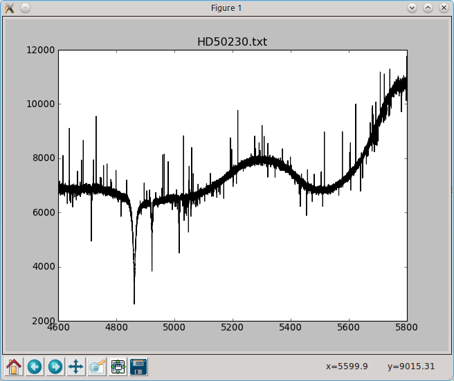
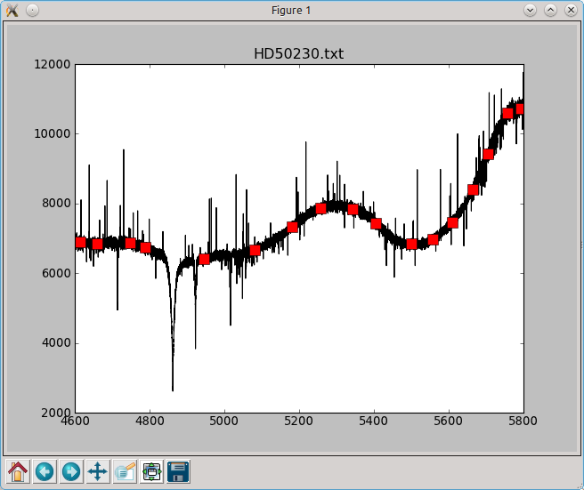
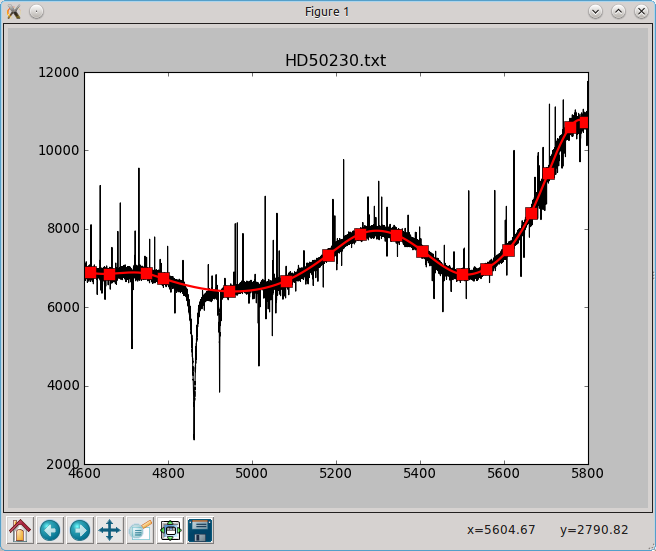
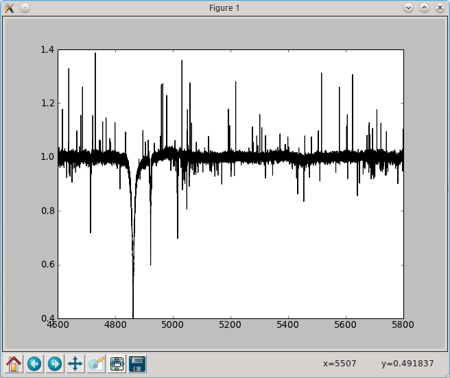

An interactive spectrum normalizer
==================================

The following script uses the matplotlib widget to normalise a spectrum using
a spline fit on user-defined points.

When saved to file ``specnorm.py``, the user can invoke the script via the
terminal with the command::
    
    $:> python specnorm.py HD50230.txt

or any other text file containing two columns (wavelength, flux). You can
download the example file `here <python4esac.githumb.com/source/plotting/HD50230.txt>`_.

When started, you get a window like this:
    

A user can left/right-click to select/deselect continuum points:
    

  
Hitting ``enter`` fits the splines throught the continuum points:

  
Hitting ``n`` normalises the spectrum:
    

  
The user can write the result to a file with ``w`` and reset to the
original spectrum with ``r``.
  
  

.. sourcecode:: python
  
    import pylab as plt
    import numpy as np
    from scipy.interpolate import splrep,splev
    import sys
    import os

    def onclick(event):
        # when none of the toolbar buttons is activated and the user clicks in the
        # plot somewhere, compute the median value of the spectrum in a 10angstrom
        # window around the x-coordinate of the clicked point. The y coordinate
        # of the clicked point is not important. Make sure the continuum points
        # `feel` it when it gets clicked, set the `feel-radius` (picker) to 5 points
        toolbar = plt.get_current_fig_manager().toolbar
        if event.button==1 and toolbar.mode=='':
            window = ((event.xdata-5)<=wave) & (wave<=(event.xdata+5))
            y = np.median(flux[window])
            plt.plot(event.xdata,y,'rs',ms=10,picker=5,label='cont_pnt')
        plt.draw()

    def onpick(event):
        # when the user clicks right on a continuum point, remove it
        if event.mouseevent.button==3:
            if hasattr(event.artist,'get_label') and event.artist.get_label()=='cont_pnt':
                event.artist.remove()            

    def ontype(event):
        # when the user hits enter:
        # 1. Cycle through the artists in the current axes. If it is a continuum
        #    point, remember its coordinates. If it is the fitted continuum from the
        #    previous step, remove it
        # 2. sort the continuum-point-array according to the x-values
        # 3. fit a spline and evaluate it in the wavelength points
        # 4. plot the continuum
        if event.key=='enter':
            cont_pnt_coord = []
            for artist in plt.gca().get_children():
                if hasattr(artist,'get_label') and artist.get_label()=='cont_pnt':
                    cont_pnt_coord.append(artist.get_data())
                elif hasattr(artist,'get_label') and artist.get_label()=='continuum':
                    artist.remove()
            cont_pnt_coord = np.array(cont_pnt_coord)[...,0]
            sort_array = np.argsort(cont_pnt_coord[:,0])
            x,y = cont_pnt_coord[sort_array].T
            spline = splrep(x,y,k=3)
            continuum = splev(wave,spline)
            plt.plot(wave,continuum,'r-',lw=2,label='continuum')
        
        # when the user hits 'n' and a spline-continuum is fitted, normalise the
        # spectrum
        elif event.key=='n':
            continuum = None
            for artist in plt.gca().get_children():
                if hasattr(artist,'get_label') and artist.get_label()=='continuum':
                    continuum = artist.get_data()[1]
                    break
            if continuum is not None:
                plt.cla()
                plt.plot(wave,flux/continuum,'k-',label='normalised')
        
        # when the user hits 'r': clear the axes and plot the original spectrum
        elif event.key=='r':
            plt.cla()
            plt.plot(wave,flux,'k-')
        
        # when the user hits 'w': if the normalised spectrum exists, write it to a
        # file.
        elif event.key=='w':
            for artist in plt.gca().get_children():
                if hasattr(artist,'get_label') and artist.get_label()=='normalised':
                    data = np.array(artist.get_data())
                    np.savetxt(os.path.splitext(filename)[0]+'.nspec',data.T)
                    print('Saved to file')
                    break
        plt.draw()        

                
    if __name__ == "__main__":  
        # Get the filename of the spectrum from the command line, and plot it
        filename = sys.argv[1]
        wave,flux = np.loadtxt(filename).T
        spectrum, = plt.plot(wave,flux,'k-',label='spectrum')
        plt.title(filename)
        
        # Connect the different functions to the different events
        plt.gcf().canvas.mpl_connect('key_press_event',ontype)
        plt.gcf().canvas.mpl_connect('button_press_event',onclick)
        plt.gcf().canvas.mpl_connect('pick_event',onpick)
        plt.show() # show the window
    